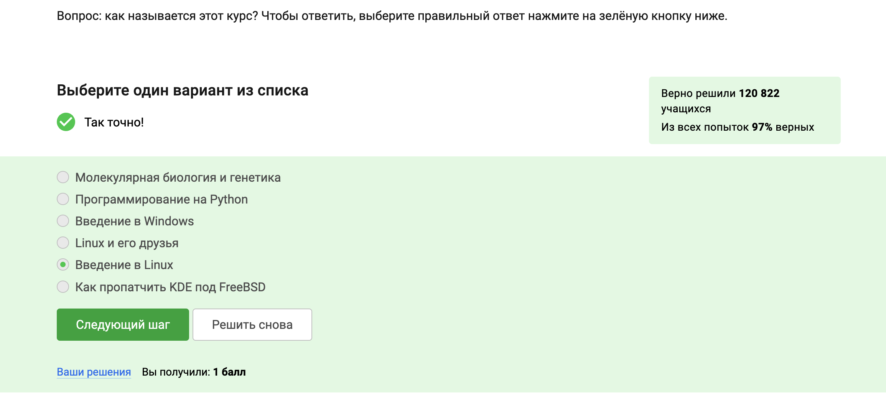
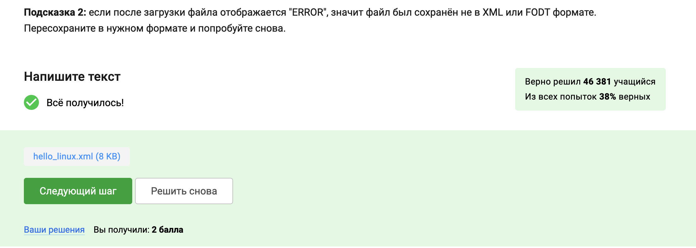
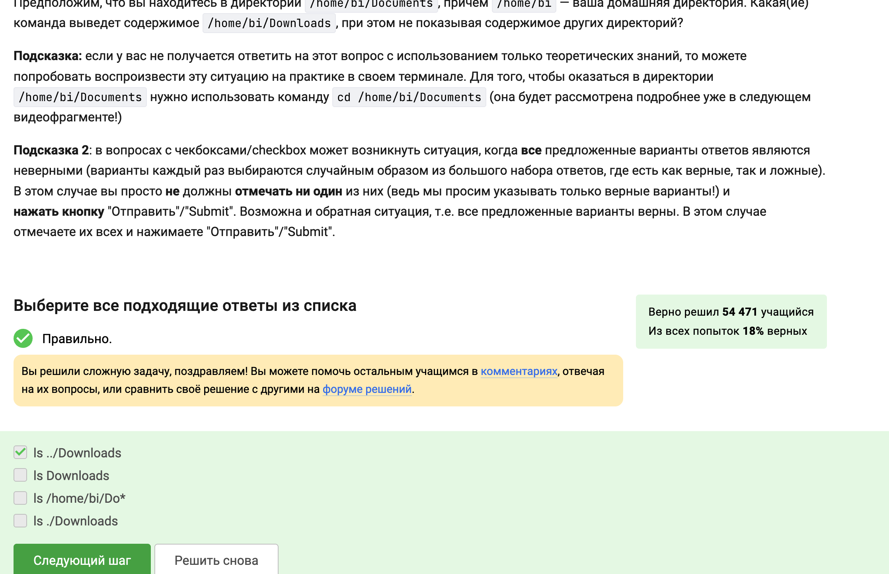
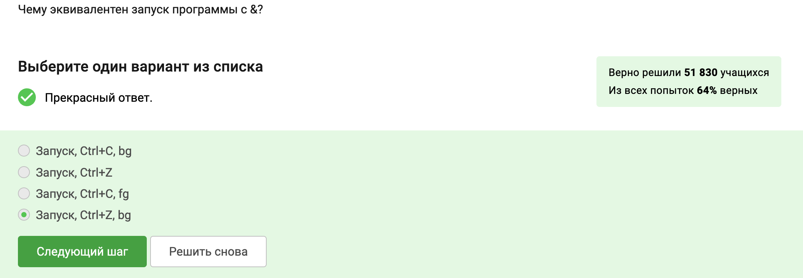
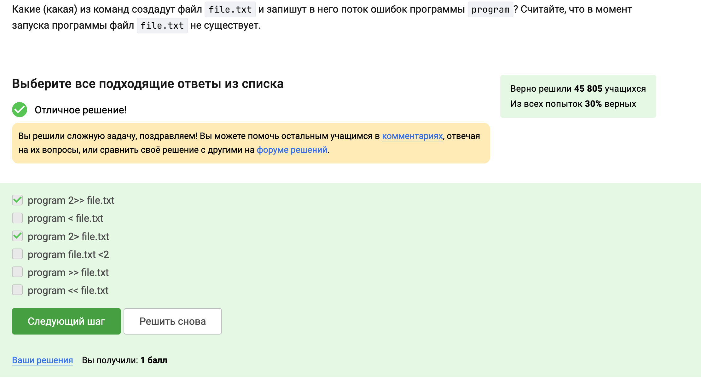
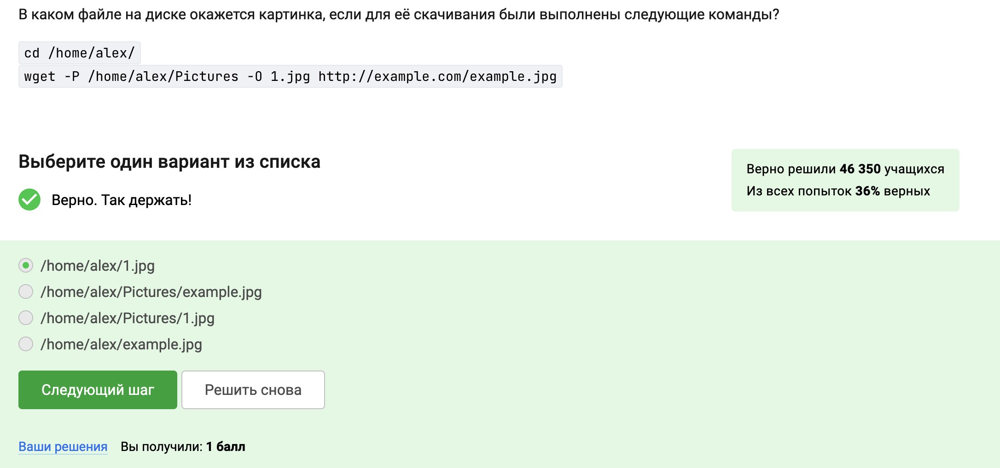
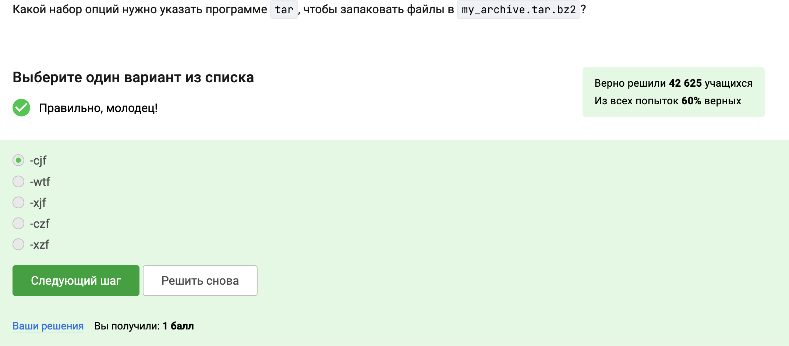
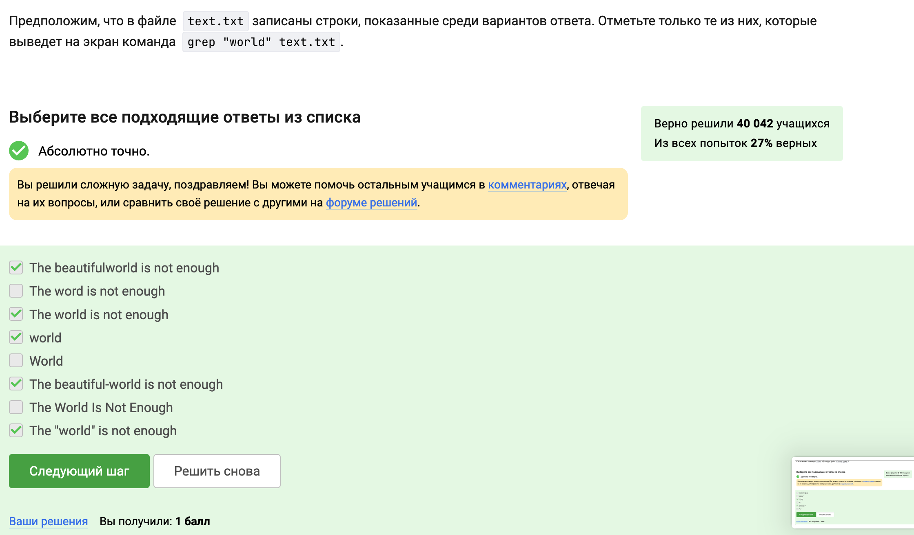

---
## Front matter
lang: ru-RU
title: Выполнение первого этапа: Введение 
subtitle: Прохождение внешнего курса
author:
  - Виеру Ж.
institute:
  - Российский университет дружбы народов, Москва, Россия
date: 16 мая 2025

## i18n babel
babel-lang: russian
babel-otherlangs: english

## Formatting pdf
toc: false
toc-title: Содержание
slide_level: 2
aspectratio: 169
section-titles: true
theme: metropolis
header-includes:
 - \metroset{progressbar=frametitle,sectionpage=progressbar,numbering=fraction}
---

# Информация

## Докладчик

:::::::::::::: {.columns align=center}
::: {.column width="70%"}

  * Виеру Женифре
  * студенитка первого курса направления "Матиматика и механика"
  * Российский университет дружбы народов
  * <https://vgenifer.github/>

:::
::: {.column width="30%"}

:::
::::::::::::::

# Вводная часть

## Актуальность

- Стабильность и надежность
- Безопасность
- Гибкость и настраиваемость
- Открытый исходный код
- Бесплатность
- DevOps

## Объект и предмет исследования

- Линукс 
- Terminal
- Ввод / вывод
- Скачивание файлов из интернета
- Архивы

## Цели и задачи

- Иззучать основы Линукса

## Материалы и методы

- курс на stepik

# Выполнение задач

## Общая информация о курсе

- Курс называется "Введение в Linux", поэтому я выбрала этот вариант ответа
:::
::: {.column width="30%"}

:::
::::::::::::::

## Как установить Linux

- виртуальная машина - это специальная программа для запуска одной ОС на другой ОС

:::
::: {.column width="30%"}

:::
::::::::::::::

## Осваиваем Linux

- Я создала документ LibreOffice Writer и написала в нём шрифтом FreeMono одну-единственную строчку:Hello, Linux!, После этого сохранила этот документ в формате XML и загрузила в форму ниже.
- Установочные пакеты в Linux (Ubuntu) имеют расширение deb
- приложение Update Manager можно использовать для обновления ссылок в Software Center, для обновления всей системы до новой версии, для обновления установленных программ

:::
::: {.column width="30%"}

:::
::::::::::::::

## Terminal: основы

- Команда pwd напечатает в какой директории мы сейчас находимся
- ls -A --human-readable -l /some/directory эквиваленты ls -lAh /some/directory, ls --almost-all --human-readable -l /some/directory, ls -Ahl /some/directory, ls -h -A -l /some/directory, ls --human-readable -A  -l /some/directory
- ls ../Downloads выведет содержимое /home/bi/Downloads, при этом не показывая содержимое других директорий
- rm -rv

:::
::: {.column width="30%"}

:::
::::::::::::::

## Запуск исполняемых файлов

- Если ввести в терминал команду firefox, а затем ввести туда же команду exit ничегт не произойдет
-  с & эквивалентно Запуск, Ctrl+Z, bg

:::
::: {.column width="30%"}

:::
::::::::::::::

## Ввод / вывод

- поток ошибок из программы, запущенной в терминале по умолчанию выводится на экране
- сообщения об ошибках (т.е. вывод в stderr) от тех программ, которые объединены в конвейер (pipe) выводятся на экране
- 
:::
::: {.column width="30%"}

:::
::::::::::::::

## Скачивание файлов из интернета

- Чтобы команде wget не выводила никаких сообщений на экран нужно написать -q
- Если запустить wget -r -l 1 -A jpg, то будут скачаны jpg и html файлы, но все html будут удалены

:::
::: {.column width="30%"}

:::
::::::::::::::

## Работа с архивами

- отличие gzip от zip: gzip удаляет архив после его распаковки
- zip и tar могут создать архив из директории с файлами
  
:::
::: {.column width="30%"}

:::
::::::::::::::

## Поиск файлов и слов в файлах

- команда find
- команда grep "world" text.txt
  
:::
::: {.column width="30%"}

:::
::::::::::::::

