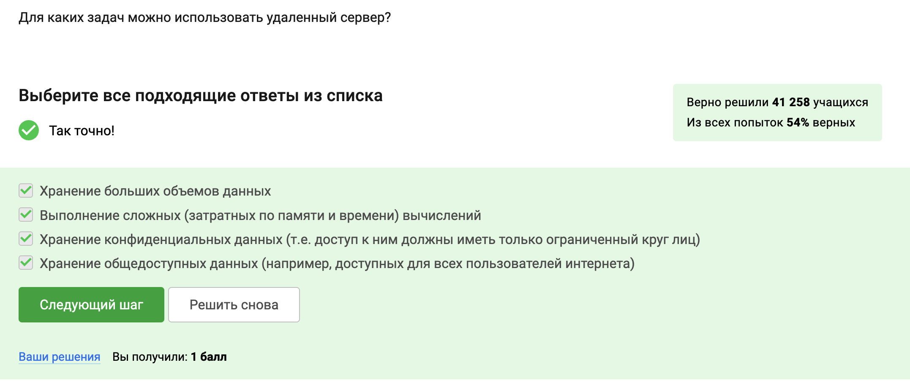
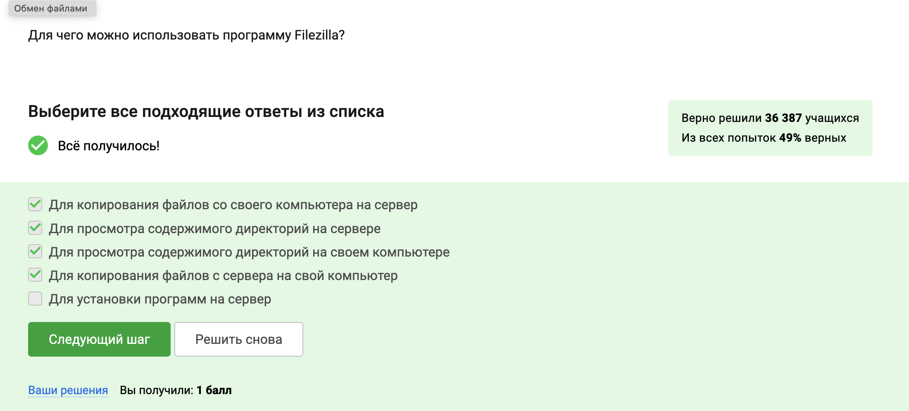
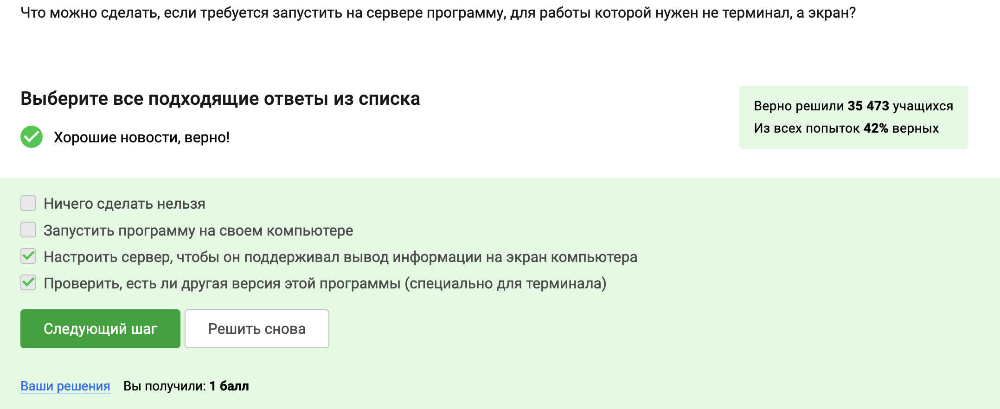
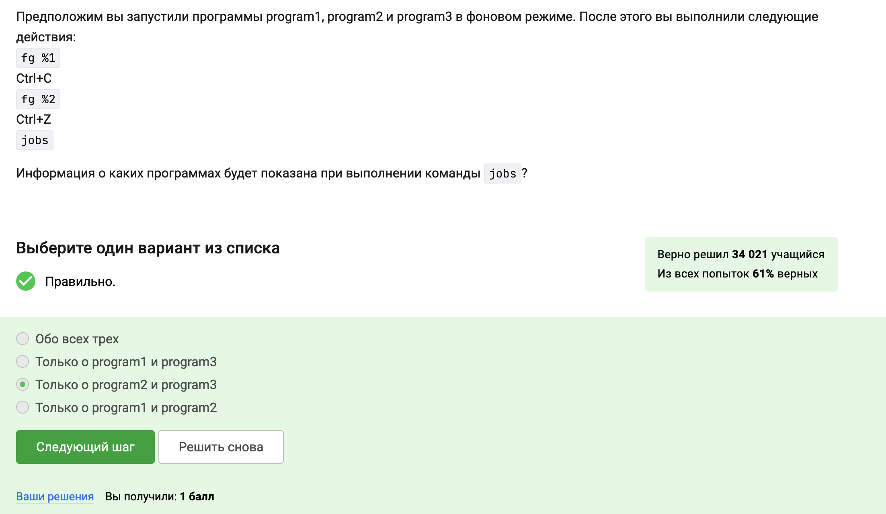
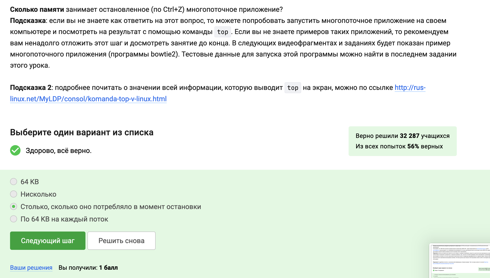
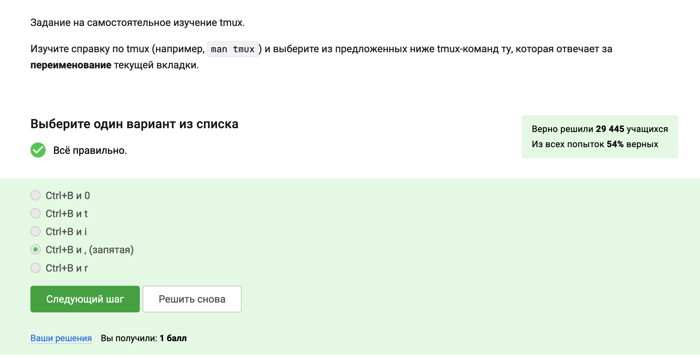

---
## Front matter
lang: ru-RU
title: Выполнение второго этапа: Работа на сервере 
subtitle: Прохождение внешнего курса
author:
  - Виеру Ж.
institute:
  - Российский университет дружбы народов, Москва, Россия
date: 16 мая 2025

## i18n babel
babel-lang: russian
babel-otherlangs: english

## Formatting pdf
toc: false
toc-title: Содержание
slide_level: 2
aspectratio: 169
section-titles: true
theme: metropolis
header-includes:
 - \metroset{progressbar=frametitle,sectionpage=progressbar,numbering=fraction}
---

# Информация

## Докладчик

:::::::::::::: {.columns align=center}
::: {.column width="70%"}

  * Виеру Женифре
  * студенитка первого курса направления "Матиматика и механика"
  * Российский университет дружбы народов
  * <https://vgenifer.github/>

:::
::: {.column width="30%"}

:::
::::::::::::::

# Вводная часть

## Актуальность

- Стабильность и надежность
- Безопасность
- Гибкость и настраиваемость
- Открытый исходный код
- Бесплатность
- DevOps

## Объект и предмет исследования

- Сервер 
- Файлы
- Запуск приложении
- Многопоточные приложения
- Менеджен тернималом tmux

## Цели и задачи

- Научиться работать на сервере

## Материалы и методы

- курс на stepik

# Выполнение задач

## Знакомство с сервером

- Для каких задач можно использовать удаленный сервер
- Ключи и их безопасность 

:::
::: {.column width="30%"}

:::
::::::::::::::

## Обмен файлами

- команда которая скопирует на сервер (в домашнюю директорию) папку stepic вместе с содержимым ее самой и всех ее подпапок(scp -r stepic username@server)
- устанавливаете программу с помощью стороки sudo apt-get install program
- Для чего можно использовать программу Filezilla

:::
::: {.column width="30%"}

:::
::::::::::::::

## Запуск приложений

- Запустить на сервере программу на экране, не на теминаде
- Вызвать справочную информацию о программе 
- Какие форматы данных FastQC может принимать на вход.

:::
::: {.column width="30%"}

:::
::::::::::::::

## Контроль запускаемых программ

- Действия fg %1, Ctrl+С, fg %2, Ctrl+Z, jobs
- Действия jobs, top и ps
- Мгновенно завершить остановленный процесс
- Действие kill -9

:::
::: {.column width="30%"}

:::
::::::::::::::

## Многопоточные приложения

- Вычислительные ресурсы центрального процессора (% CPU)
- Памяти занимающая остановленное (по Ctrl+Z) многопоточное приложение
- Как принудительно завершить один из потоков запущенного многопоточного приложения
- Программа bowtie2
- 

:::
::: {.column width="30%"}

:::
::::::::::::::

## Менеджер терминалов tmux

- Денйствие fg
- Команда exit
- Запуск tmux в сервере

:::
::: {.column width="30%"}

:::
::::::::::::::

