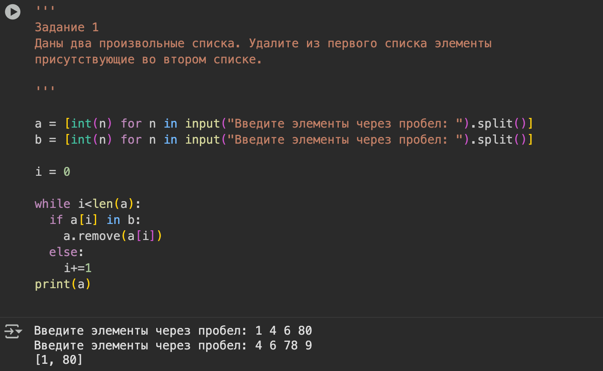
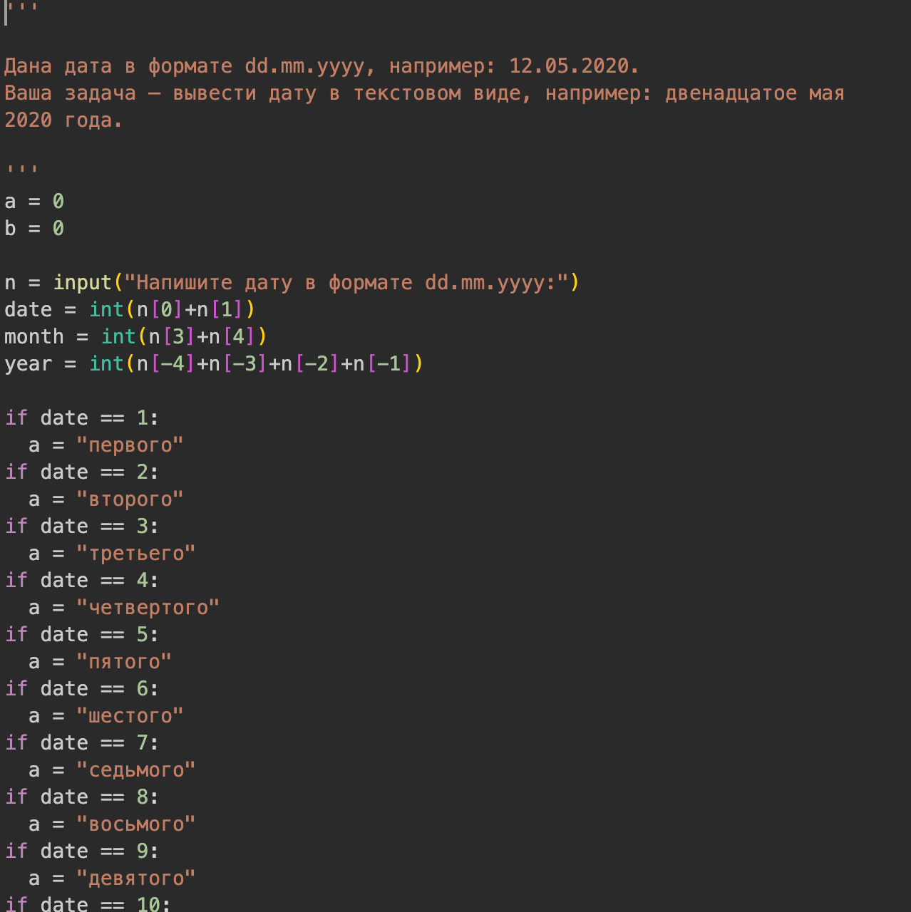
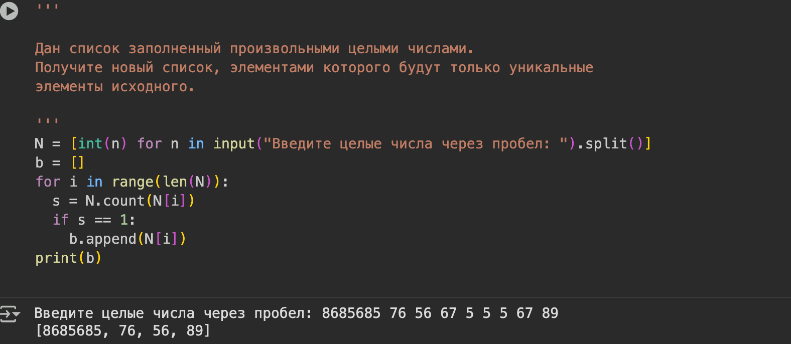
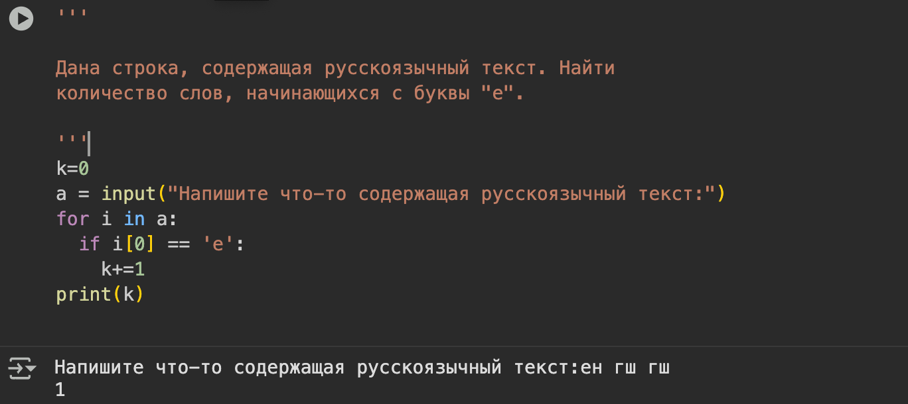
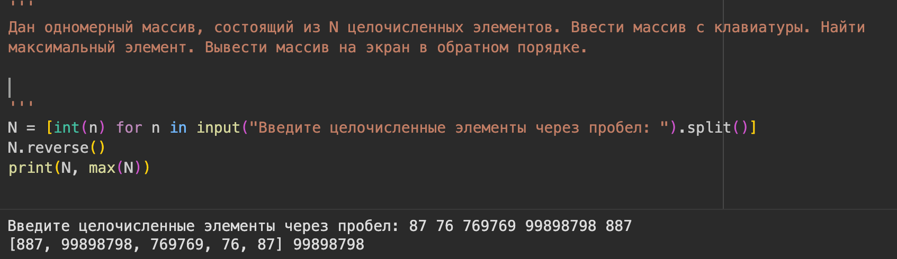
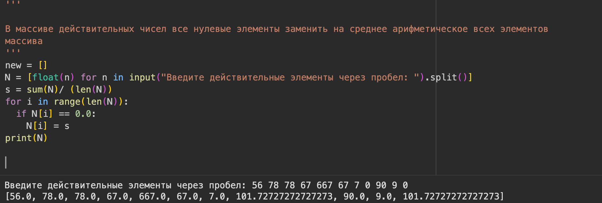

---
## Front matter
title: "Лабораторная работа №2"
subtitle: "Введение в программирование на языке Python"
author: "Виеру Женифер"

## Generic otions
lang: ru-RU
toc-title: "Содержание"

## Bibliography
bibliography: bib/cite.bib
csl: pandoc/csl/gost-r-7-0-5-2008-numeric.csl

## Pdf output format
toc: true # Table of contents
toc-depth: 2
lof: true # List of figures
lot: true # List of tables
fontsize: 12pt
linestretch: 1.5
papersize: a4
documentclass: scrreprt
## I18n polyglossia
polyglossia-lang:
  name: russian
  options:
	- spelling=modern
	- babelshorthands=true
polyglossia-otherlangs:
  name: english
## I18n babel
babel-lang: russian
babel-otherlangs: english
## Fonts
mainfont: IBM Plex Serif
romanfont: IBM Plex Serif
sansfont: IBM Plex Sans
monofont: IBM Plex Mono
mathfont: STIX Two Math
mainfontoptions: Ligatures=Common,Ligatures=TeX,Scale=0.94
romanfontoptions: Ligatures=Common,Ligatures=TeX,Scale=0.94
sansfontoptions: Ligatures=Common,Ligatures=TeX,Scale=MatchLowercase,Scale=0.94
monofontoptions: Scale=MatchLowercase,Scale=0.94,FakeStretch=0.9
mathfontoptions:
## Biblatex
biblatex: true
biblio-style: "gost-numeric"
biblatexoptions:
  - parentracker=true
  - backend=biber
  - hyperref=auto
  - language=auto
  - autolang=other*
  - citestyle=gost-numeric
## Pandoc-crossref LaTeX customization
figureTitle: "Рис."
tableTitle: "Таблица"
listingTitle: "Листинг"
lofTitle: "Список иллюстраций"
lotTitle: "Список таблиц"
lolTitle: "Листинги"
## Misc options
indent: true
header-includes:
  - \usepackage{indentfirst}
  - \usepackage{float} # keep figures where there are in the text
  - \floatplacement{figure}{H} # keep figures where there are in the text
---

# Цель работы

Знакомство с методами работы со строками, списками (одномерные массивы), словарями и множествами

# Выполнение лабораторной работы

Для выполнения этой задачи я использовала команду .remove(). (рис. [-@fig:001]).

{#fig:001 width=70%}

Для выполнении этой задачи я написала несколько циклов, где я заменяла цифры на слова. (рис. [-@fig:002]).

{#fig:002 width=70%}

Для выполнения этой задачи я проверяла количество элемента в списке, и если количество равно 1, то добавила в новы список. Таким образом, я составила список с неповторяющимся элементами. (рис. [-@fig:003]).

{#fig:003 width=70%}

Для выполнения этой задачи я проверяла, если число начинается с "e". (рис. [-@fig:004]).

{#fig:004 width=70%}

Для выполнения этой задачи я использовала команду .reverse(). (рис. [-@fig:005]).

{#fig:005 width=70%}

{#fig:006 width=70%}

# Ответы на контрольные вопросы

1. Назовите четыре основных типа данных Python.
   Числа, строки, списки и логическийтип.
2. Почему они называются “основными” типами данных?
   Типы данных называются "основными", потому что они являются базовыми, примитивными структурами, которые реализованы непосредственно в самом языке программирования и поддерживаются аппаратным обеспечением компьютера.
3. Что означает “неизменяемость”, и какие три основных типа Python считаются
неизменяемыми?
	"Неизменяемость" (неизменность) в Python означает, что значение объекта не может быть изменено после его создания. Основными неизменяемыми типами данных в Python являются числа (целые int, с плавающей точкой float, комплексные complex), строки (str), кортежи (tuple) и неизменяемые множества (frozenset).
4. Что означает “последовательность”, и какие три типа входят в эту категорию?
   Последовательность в математике — пронумерованный набор каких-либо объектов, среди которых допускаются повторения, причём порядок объектов имеет значение.list списки,tuple кортежи, range диапазоны.
5. Для заданной строки S со значением "s,pa,in" назовите два способа извлечения двух
символов из середины строки.
	Для строки "s,pa,in" два способа извлечь два символа из середины ("pa") — использовать метод split(), разделив строку по запятой и взяв второй элемент списка, или использовать индексацию и слайсинг (например, s[3:5]), получив подстроку по индексу до индекса (не включая его). 

# Выводы

При выполнении данной лабораторной работы я знакомилась с методами работы со строками, списками (одномерные массивы), словарями и множествами.

