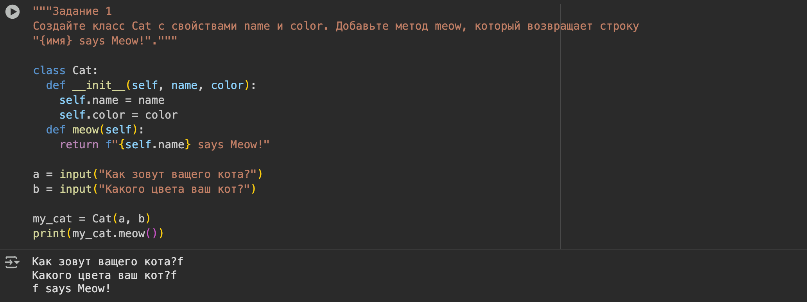
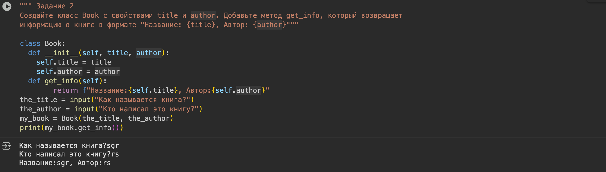
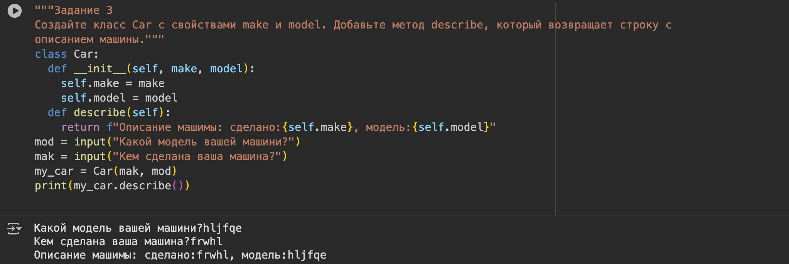
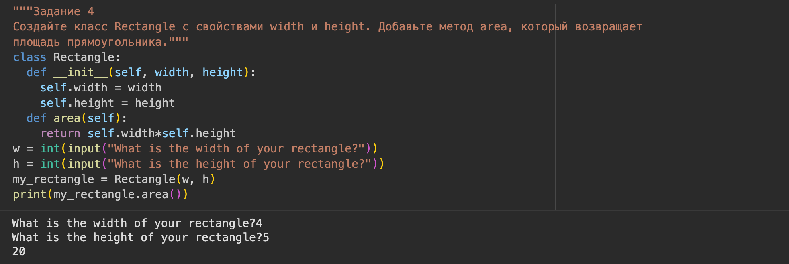
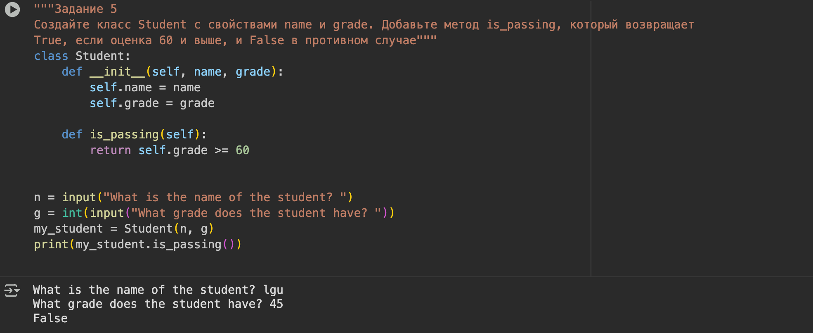
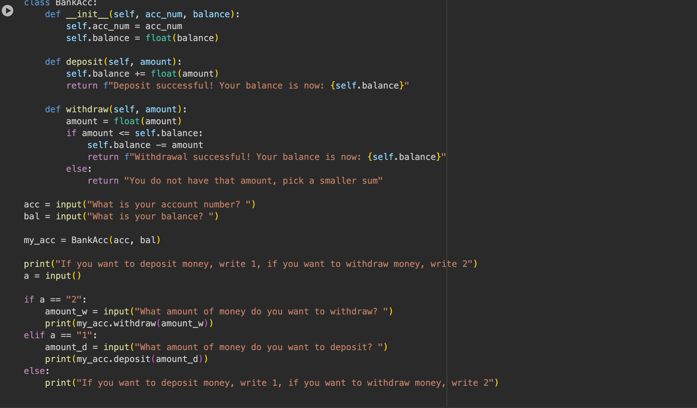
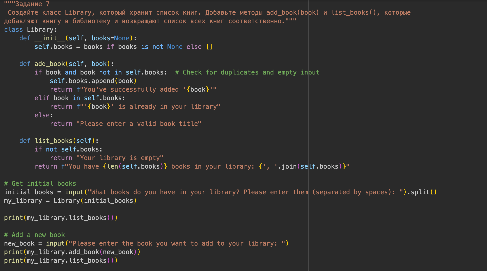
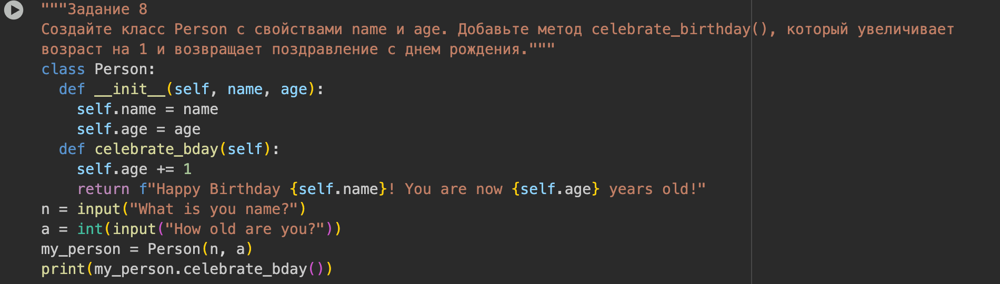

---
## Front matter
title: "Лабораторная работа №4"
subtitle: "Введение в программирование на языке Python"
author: "Виеру Женифер"

## Generic otions
lang: ru-RU
toc-title: "Содержание"

## Bibliography
bibliography: bib/cite.bib
csl: pandoc/csl/gost-r-7-0-5-2008-numeric.csl

## Pdf output format
toc: true # Table of contents
toc-depth: 2
lof: true # List of figures
lot: true # List of tables
fontsize: 12pt
linestretch: 1.5
papersize: a4
documentclass: scrreprt
## I18n polyglossia
polyglossia-lang:
  name: russian
  options:
	- spelling=modern
	- babelshorthands=true
polyglossia-otherlangs:
  name: english
## I18n babel
babel-lang: russian
babel-otherlangs: english
## Fonts
mainfont: IBM Plex Serif
romanfont: IBM Plex Serif
sansfont: IBM Plex Sans
monofont: IBM Plex Mono
mathfont: STIX Two Math
mainfontoptions: Ligatures=Common,Ligatures=TeX,Scale=0.94
romanfontoptions: Ligatures=Common,Ligatures=TeX,Scale=0.94
sansfontoptions: Ligatures=Common,Ligatures=TeX,Scale=MatchLowercase,Scale=0.94
monofontoptions: Scale=MatchLowercase,Scale=0.94,FakeStretch=0.9
mathfontoptions:
## Biblatex
biblatex: true
biblio-style: "gost-numeric"
biblatexoptions:
  - parentracker=true
  - backend=biber
  - hyperref=auto
  - language=auto
  - autolang=other*
  - citestyle=gost-numeric
## Pandoc-crossref LaTeX customization
figureTitle: "Рис."
tableTitle: "Таблица"
listingTitle: "Листинг"
lofTitle: "Список иллюстраций"
lotTitle: "Список таблиц"
lolTitle: "Листинги"
## Misc options
indent: true
header-includes:
  - \usepackage{indentfirst}
  - \usepackage{float} # keep figures where there are in the text
  - \floatplacement{figure}{H} # keep figures where there are in the text
---

# Цель работы

Знакомство с механизмом ООП.

# Выполнение лабораторной работы

Создайте класс Cat с свойствами name и color. Добавьте метод meow, который возвращает строку
"{имя} says Meow!". (рис. [-@fig:001]).

{#fig:001 width=70%}

Создайте класс Book с свойствами title и author. Добавьте метод get_info, который возвращает
информацию о книге в формате "Название: {title}, Автор: {author}". (рис. [-@fig:002]).

{#fig:002 width=70%}

Создайте класс Car с свойствами make и model. Добавьте метод describe, который возвращает строку с
описанием машины. (рис. [-@fig:003]).

{#fig:003 width=70%}

Создайте класс Rectangle с свойствами width и height. Добавьте метод area, который возвращает
площадь прямоугольника. (рис. [-@fig:004]).

{#fig:004 width=70%}

Создайте класс Student с свойствами name и grade. Добавьте метод is_passing, который возвращает
True, если оценка 60 и выше, и False в противном случае. (рис. [-@fig:005]).

{#fig:005 width=70%}

Создайте класс BankAccount с свойствами account_number и balance. Добавьте методы deposit(amount) и
withdraw(amount), которые изменяют баланс. (рис. [-@fig:006]).

{#fig:006 width=70%}

Создайте класс Library, который хранит список книг. Добавьте методы add_book(book) и list_books(), которые
добавляют книгу в библиотеку и возвращают список всех книг соответственно.(рис. [-@fig:007]).

{#fig:007 width=70%}

Создайте класс Person с свойствами name и age. Добавьте метод celebrate_birthday(), который увеличивает
возраст на 1 и возвращает поздравление с днем рождения. (рис. [-@fig:008]).

{#fig:008 width=70%}

# Ответы на контрольные вопросы

1. Что такое класс и объект?
	Класс и объект - это основные понятия объектно-ориентированного программирования (ООП).
	Объясните разницу между классом и объектом, приведите примеры.
	Класс - это "чертеж" или "шаблон"
	Класс описывает: Какие данные будут храниться (атрибуты/свойства) и какие действия можно выполнять (методы/функции)
	Объект - это "экземпляр" класса.Объект - это конкретная вещь, созданная по чертежу класса.
2. Что такое инкапсуляция?
   Инкапсуляция - это один из основных принципов объектно-ориентированного программирования, который означает объединение данных и методов в одной единице (классе) и ограничение прямого доступа к внутренним данным.
	Опишите концепцию инкапсуляции и приведите пример её использования.
	Суть инкапсуляции:Объединение данных и методов в одном классе, Сокрытие внутренней реализации, Контроль доступа через публичные методы, Защита данных от некорректных изменений
4. Что такое наследование?
   Наследование — это принцип ООП, который позволяет создавать новый класс на основе существующего, перенимая его свойства и методы, а также добавляя новые или изменяя существующие.
Объясните, что такое наследование, как оно работает и какие преимущества оно предоставляет.
Основная концепция:
Родительский класс (суперкласс) — базовый класс
Дочерний класс (подкласс) — наследует от родителя
Отношение "является" — дочерний класс является специализированной версией родительского
Преимущества наследования
1. Повторное использование кода
2. Расширяемость
3. Полиморфизм
4. Легкость поддержки
6. Что такое полиморфизм?
   Полиморфизм (от греческого "много форм") — это принцип ООП, который позволяет объектам разных классов использовать методы с одинаковыми именами, но разной реализацией.
Определите полиморфизм и приведите пример, как он может быть реализован в Python.
class Animal:
    def make_sound(self):
        return "Издает звук"
    
    def move(self):
        return "Двигается"

class Dog(Animal):
    def make_sound(self):
        return "🐶 Гав-гав!"
    
    def move(self):
        return "🐶 Собака бежит"

class Cat(Animal):
    def make_sound(self):
        return "🐱 Мяу!"
    
    def move(self):
        return "🐱 Кошка крадется"

class Bird(Animal):
    def make_sound(self):
        return "🐦 Чик-чирик!"
    
    def move(self):
        return "🐦 Птица летит"

class Fish(Animal):
    def make_sound(self):
        return "🐟 ... (рыбы не разговаривают)"
    
    def move(self):
        return "🐟 Рыба плывет"

# Использование полиморфизма
def animal_concert(animals):
    print("🎵 Концерт животных!\n")
    
    for animal in animals:
        print(f"{animal.make_sound()} - {animal.move()}")

animals = [Dog(), Cat(), Bird(), Fish()]
animal_concert(animals)
8. Что такое абстракция?
Объясните, как абстракция помогает в проектировании программ и приведите пример её использования.
Абстракция — это принцип ООП, который позволяет скрыть сложную реализацию и показать только необходимые детали пользователю. Это процесс выделения существенных характеристик объекта и игнорирования несущественных.
Основная идея:
Скрытие сложности — пользователь видит только "что делает", а не "как делает"
Фокусировка на интерфейсе — важно как использовать, а не как реализовано
Упрощение работы — работа с высокоуровневыми концепциями
def demonstrate_banking_system():
    print("=== БАНКОВСКАЯ СИСТЕМА С АБСТРАКЦИЕЙ ===\n")
    
Создаем счета разных типов
    savings = SavingsAccount("Иван Петров", 5000)
    credit = CreditAccount("Анна Сидорова", 10000)
    accounts = [savings, credit]
    EДИНЫЙ ИНТЕРФЕЙС - несмотря на разную реализацию
    for account in accounts:
        print("🔹" * 40)
        print(account.get_account_info())
        print(account.get_balance())
         Одинаковые методы, разное поведение
        print(account.deposit(1000))
        print(account.withdraw(500))
        print(account.get_balance())
         Специфичные методы
        if isinstance(account, SavingsAccount):
            print(account.apply_interest())
    	 	print("\n" + "=" * 50)
demonstrate_banking_system()
9. Каковы основные принципы ООП?
Назовите и кратко опишите четыре основных принципа объектно-ориентированного программирования.
Краткий обзор   Принцип	Суть	                         Простая аналогия
Инкапсуляция	Объединение данных и методов + защита	Автомобиль с капотом
Наследование	Создание новых классов на основе существующих	Семейное древо
Полиморфизм	Один интерфейс - много реализаций	Пульт управления
Абстракция	Сокрытие сложности, показ только важного	Вождение автомобиля

10. Как реализовать интерфейсы и абстрактные классы в Python?
Объясните, что такое абстрактные классы и интерфейсы, и как они могут быть реализованы в Python.

Абстрактный класс
Класс, который не предназначен для создания экземпляров
Содержит абстрактные методы (без реализации)
Может содержать обычные методы с реализацией
Используется как шаблон для других классов
Интерфейс
Полностью абстрактный класс (только абстрактные методы)
Определяет контракт, который должны реализовать классы
Не содержит реализации методов

