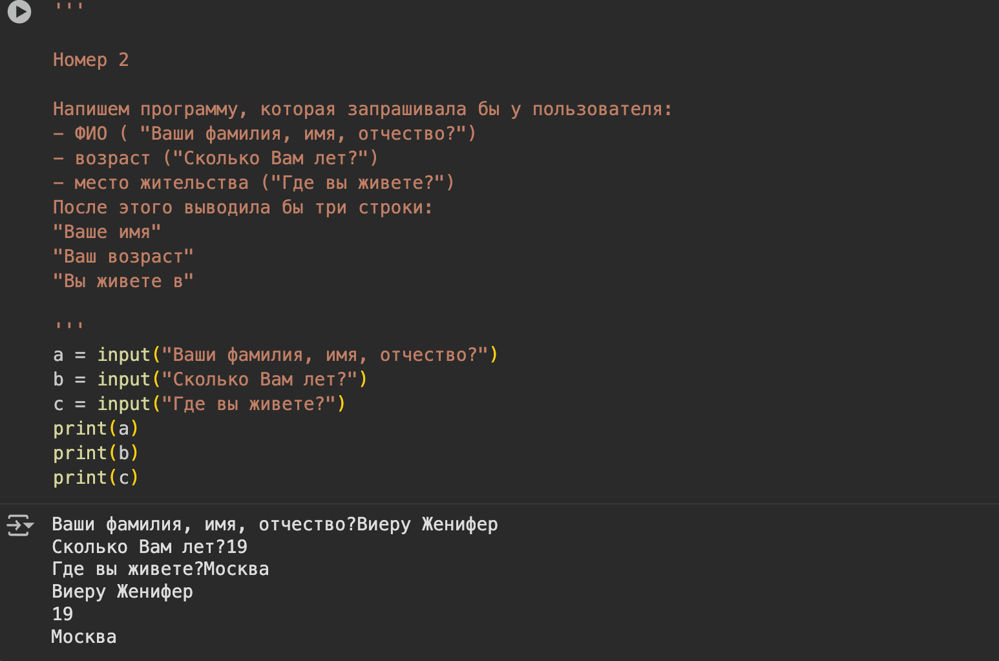
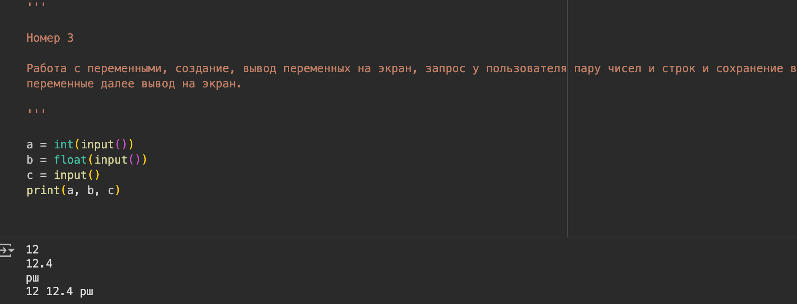
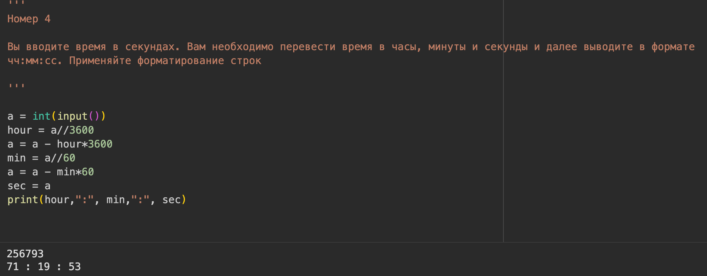
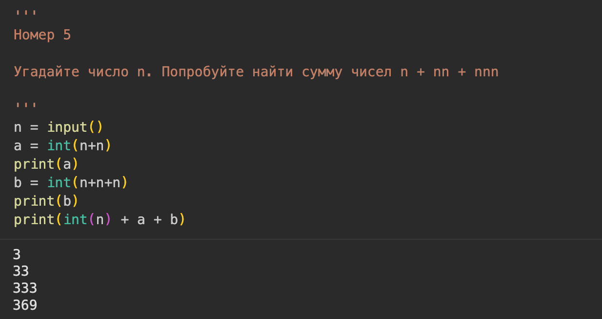
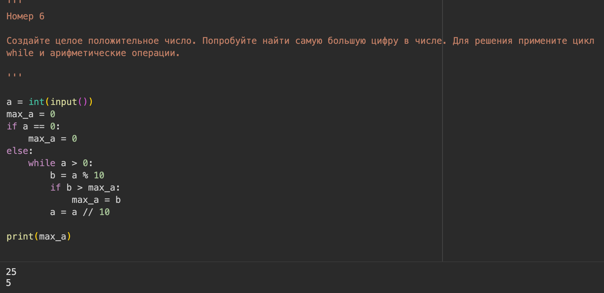
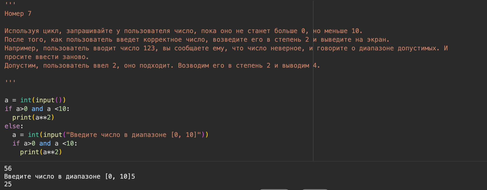
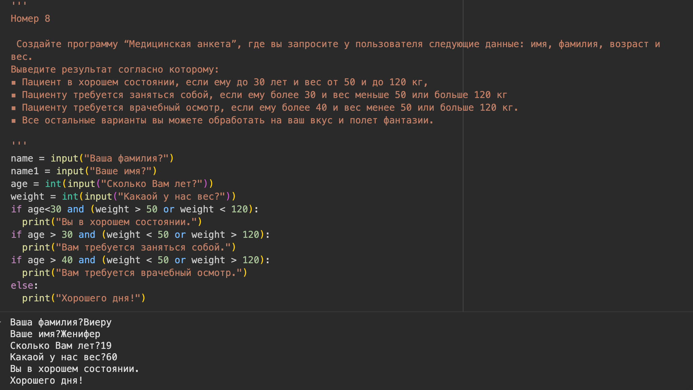
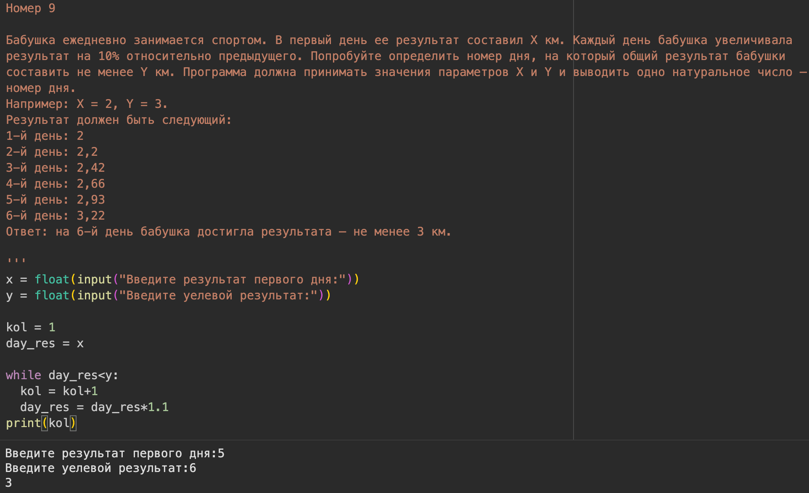

---
## Front matter
title: "Лабораторная работа №1"
subtitle: "Введение в программирование на языке Python"
author: "Виеру Женифер"

## Generic otions
lang: ru-RU
toc-title: "Содержание"

## Bibliography
bibliography: bib/cite.bib
csl: pandoc/csl/gost-r-7-0-5-2008-numeric.csl

## Pdf output format
toc: true # Table of contents
toc-depth: 2
lof: true # List of figures
lot: true # List of tables
fontsize: 12pt
linestretch: 1.5
papersize: a4
documentclass: scrreprt
## I18n polyglossia
polyglossia-lang:
  name: russian
  options:
	- spelling=modern
	- babelshorthands=true
polyglossia-otherlangs:
  name: english
## I18n babel
babel-lang: russian
babel-otherlangs: english
## Fonts
mainfont: IBM Plex Serif
romanfont: IBM Plex Serif
sansfont: IBM Plex Sans
monofont: IBM Plex Mono
mathfont: STIX Two Math
mainfontoptions: Ligatures=Common,Ligatures=TeX,Scale=0.94
romanfontoptions: Ligatures=Common,Ligatures=TeX,Scale=0.94
sansfontoptions: Ligatures=Common,Ligatures=TeX,Scale=MatchLowercase,Scale=0.94
monofontoptions: Scale=MatchLowercase,Scale=0.94,FakeStretch=0.9
mathfontoptions:
## Biblatex
biblatex: true
biblio-style: "gost-numeric"
biblatexoptions:
  - parentracker=true
  - backend=biber
  - hyperref=auto
  - language=auto
  - autolang=other*
  - citestyle=gost-numeric
## Pandoc-crossref LaTeX customization
figureTitle: "Рис."
tableTitle: "Таблица"
listingTitle: "Листинг"
lofTitle: "Список иллюстраций"
lotTitle: "Список таблиц"
lolTitle: "Листинги"
## Misc options
indent: true
header-includes:
  - \usepackage{indentfirst}
  - \usepackage{float} # keep figures where there are in the text
  - \floatplacement{figure}{H} # keep figures where there are in the text
---

# Цель работы

1. Познакомиться со средой разработки Python. Изучить основные типы данных, команды ввода и вывода данных.
2. Познакомиться со структурой ветвление (if, if-else, if-elif-else).
3. Познакомиться с циклическими конструкциями

# Выполнение лабораторной работы

Для выполнения этой задачи я использовала команду input(). (рис. [-@fig:001]).

{#fig:001 width=70%}

Для задачи я изучала разные типы данных, int - целое число, float - вещественное число и str - сторока. (рис. [-@fig:002]).

{#fig:002 width=70%}

Для выполнения этой задачи я расситала сколько минут, часов в поределенном количстве секунд. (рис. [-@fig:003]).

{#fig:003 width=70%}

Для выполнения этой задачи я использовала разние типы данных, чтобы поличить то, что хотела. (рис. [-@fig:004]).

{#fig:004 width=70%}

Для выполнения этой задачи я проверяла каждую цифру с конца, чтобы найти найбольшую. (рис. [-@fig:005]).

{#fig:005 width=70%}

Для выполнения этой задачи я использовала конструкцию if – else. (рис. [-@fig:006]).

{#fig:006 width=70%}

Для выполнения этой задачи я использовала команду inpput() и конструкцию if – else. (рис. [-@fig:007]).

{#fig:007 width=70%}

Для выполнения этой задачи я использовала счетчик kol, чтобы засчитать количество дней. (рис. [-@fig:008]).

{#fig:008 width=70%}

# Ответы на контрольные вопросы

1. Назовите шесть основных причин, по которым программисты выбирают Python.
   Python простой в изучении. Его легко читать и понять, если ты не знаешь язык. Python быстрый. Python используется в разных сверах. Python работает на любой операционной системы. Python можно интегртровать с другими языками программирования.
2. Назовите четыре известные компании или организации, использующие Python.
   Google, Netflix, Spotify и Instagram
3. Почему бы вы не хотели использовать Python в приложениях?
   Python может не подойти для приложений из-за низкой скорости выполнения по сравнению с компилируемыми языками, ограничений в многопоточных задачах, а также из-за относительной слабости в мобильной разработке и фронтенде
4. Какие задачи можно решать с помощью Python?
   Python — это универсальный язык программирования, который решает широкий спектр задач: от веб-разработки и анализа данных до автоматизации рутинных процессов, машинного обучения и создания игр
5. Что такое интерпретатор Python?
   Интерпретатор Python — это программа, которая выполняет код, написанный на языке Python, анализируя и выполняя его инструкции построчно. 
6. Что такое исходный программный код?
   Исходный программный код — это человекочитаемый набор инструкций и команд, написанный на языке программирования (например, Python, C++), который описывает, как должна работать программа или приложение
7. Как запустить интерактивный сеанс работы с интерпретатором?
   Нужно ввести команду python и наживать Enter
8. Как запустить сценарий из среды разработки IDLE?
    Чтобы запустить скрипт в IDLE, откройте его через меню «Пуск» или двойным щелчком по файлу, затем напишите или вставьте ваш код в окно редактора и нажмите F5 или выберите в меню «Run» → «Run Module». После этого результат выполнения скрипта появится в окне IDLE Shell.  
9. Какой тип будет иметь результат следующего выражения: 1 + 2.0 +3?
    <class 'float'>
10. Назовите три способа, с помощью которых можно присвоить одно и то же значение трем переменным.
	Цепочное присваивание, последовательное присваивание, присваивание через упаковку/распаковку.
15. Как в языке Python можно оформить инструкцию if/else в виде выражения?
    Значение_если_истина if условие else значение_если_ложь
17. Что означают слова True и False?
    Истина и Ложь.
19. Когда выполняется блок else в циклах?
    Если не выполняется блок if.

# Выводы

При выполнении данной лабораторной работы я изучила основные типы данных, команды ввода и вывода данных. Я вспомнила структурой ветвление (if, if-else, if-elif-else) и циклические конструкции.

