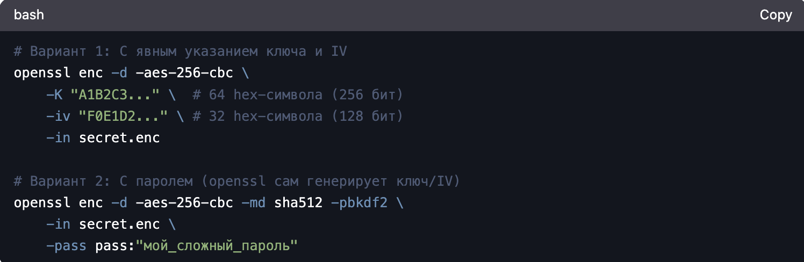

---
## Front matter
lang: ru-RU
title: Методы криптования на основе закрытого ключа 
author:
  - Виеру Ж.
institute:
  - Российский университет дружбы народов, Москва, Россия
date: 04 апреля 2025

## i18n babel
babel-lang: russian
babel-otherlangs: english

## Formatting pdf
toc: false
toc-title: Содержание
slide_level: 2
aspectratio: 169
section-titles: true
theme: metropolis
header-includes:
 - \metroset{progressbar=frametitle,sectionpage=progressbar,numbering=fraction}
---

# Информация

## Докладчик

:::::::::::::: {.columns align=center}
::: {.column width="70%"}

  * Виеру Женифер
  * студентка
  * студентка певого курса направлении "Математика и механика", первая группа
  * Российский университет дружбы народов
  * [1132246785@pfur.ru](mailto:1132246785@pfur.ru)
  * <https://github.com/vgenifer>

:::
::: {.column width="30%"}

:::
::::::::::::::

# Вводная часть

## Актуальность

- Обеспечивает скорость
- Доказало надёжность
- Интегрировано во все ключевые технологии
- Соответствует жёстким требованиям безопасности

## Объект и предмет исследования

- UNIX-системы (Linux, macOS) и их механизмы безопасности
- Алгоритмы симметричного шифрования (AES, ChaCha20) и их реализация в UNIX
- Методы управления ключами (KMS, HSM)

## Цели и задачи

- Изучать теорию методов криптования на основе закрытого ключа и рассматривать как это испоьзовать на практике
- Изучить принципы симметричного шифрования и его отличие от асимметричного.
- Проанализировать ключевые алгоритмы (AES, ChaCha20, 3DES) и их криптостойкость.
- Исследовать стандарты и требования (NIST FIPS, PCI DSS, GDPR), предъявляемые к шифрованию данных.
- Сравнить производительность алгоритмов (например, AES-256 vs. ChaCha20) на разных платформах (Linux, macOS).

## Научная новизна

- Анализ устойчивости алгоритмов к квантовым атакам
- Новые подходы к управлению ключами в облачных средах

## Практическая значимость работы

- Глубокое изучение методы криптования на основе закрытого ключа 

# Теоретическая база

## Принципы симметричного шифрования

- Один ключ для всех операций
- Высокая скорость работы
- Алгоритмы

## Принципы асимметричного шифрования

- Два ключа: открытый и закрытый
- Медленная скорость
- Алгоритмы

## Анализ ключевых алгоритмов симметричного шифрования

- AES
- ChaCha20
- 3DES

## Исследование стандартов и требованиях, предъявляемые к шифрованию данных.

- NIST FIPS
- PCI DSS
- GDPR

## Сравнение производительность алгоритмов на разных платформах

- AES-256 vs. ChaCha20

# Содержание исследования. Шифрование на основе закрытого ключа

## Основные алгоритмы

- AES
- ChaCha20
- 3DES

## Практические примеры

:::
::: {.column width="100%"}

:::
::::::::::::::

## Генерация ключей

:::
::: {.column width="100%"}

:::
::::::::::::::

## Безопасное хранение ключей

- В переменных окружения
- В защищённых файлах 
- В аппаратных модулях 

## Дешифровка в памяти

:::
::: {.column width="100%"}

:::
::::::::::::::

## Результаты

Таким образом, я изучила теорию методов криптования на основе закрытого ключа и рассматривала как это испоьзовать на практике,изучила принципы симметричного шифрования и его отличие от асимметричного.Потом я проанализировала ключевые алгоритмы (AES, ChaCha20, 3DES) и их криптостойкость, исследовала стандарты и требования (NIST FIPS, PCI DSS, GDPR), предъявляемые к шифрованию данных и сравнила производительность алгоритмов (например, AES-256 vs. ChaCha20) на разных платформах (Linux, macOS).

## Итоговый слайд

- Симметричное шифрование на основе закрытого ключа использует один ключ для шифрования и дешифрования, обеспечивая высокую скорость (AES-256, ChaCha20), и применяется в UNIX-системах для защиты файлов (OpenSSL), дисков (LUKS) и сетевого трафика (TLS), но требует безопасного управления ключами (mlock(), HSM) и избегания утечек через своп или дампы памяти. Актуальность обусловлена соответствием стандартам (NIST FIPS, PCI DSS, GDPR), устойчивостью к атакам и эффективностью в гибридных системах (RSA+AES), хотя для безопасности необходимо избегать устаревших алгоритмов (3DES) и слабых режимов (ECB).

