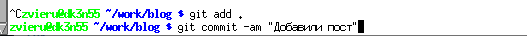

---
## Front matter
title: "Отчет на втором этапе индивидуального проекта"
subtitle: "Простейший вариант"
author: "Виеру Женифер"

## Generic otions
lang: ru-RU
toc-title: "Содержание"

## Bibliography
bibliography: bib/cite.bib
csl: pandoc/csl/gost-r-7-0-5-2008-numeric.csl

## Pdf output format
toc: true # Table of contents
toc-depth: 2
lof: true # List of figures
lot: true # List of tables
fontsize: 12pt
linestretch: 1.5
papersize: a4
documentclass: scrreprt
## I18n polyglossia
polyglossia-lang:
  name: russian
  options:
	- spelling=modern
	- babelshorthands=true
polyglossia-otherlangs:
  name: english
## I18n babel
babel-lang: russian
babel-otherlangs: english
## Fonts
mainfont: IBM Plex Serif
romanfont: IBM Plex Serif
sansfont: IBM Plex Sans
monofont: IBM Plex Mono
mathfont: STIX Two Math
mainfontoptions: Ligatures=Common,Ligatures=TeX,Scale=0.94
romanfontoptions: Ligatures=Common,Ligatures=TeX,Scale=0.94
sansfontoptions: Ligatures=Common,Ligatures=TeX,Scale=MatchLowercase,Scale=0.94
monofontoptions: Scale=MatchLowercase,Scale=0.94,FakeStretch=0.9
mathfontoptions:
## Biblatex
biblatex: true
biblio-style: "gost-numeric"
biblatexoptions:
  - parentracker=true
  - backend=biber
  - hyperref=auto
  - language=auto
  - autolang=other*
  - citestyle=gost-numeric
## Pandoc-crossref LaTeX customization
figureTitle: "Рис."
tableTitle: "Таблица"
listingTitle: "Листинг"
lofTitle: "Список иллюстраций"
lotTitle: "Список таблиц"
lolTitle: "Листинги"
## Misc options
indent: true
header-includes:
  - \usepackage{indentfirst}
  - \usepackage{float} # keep figures where there are in the text
  - \floatplacement{figure}{H} # keep figures where there are in the text
---

# Цель работы

При выполнении данной лабораторной работы, я планирую:добавить личные данные о себя,разместить фотографию себя на сайта, разместить краткое описание себя на сайта (Biography),добавить информацию об интересах (Interests),добавить информацию от образовании (Education),сделать пост по прошедшей неделе,добавить пост на тему по выбору:Управление версиями. Git. Цель данного этапа, научиться работать с hugo.

# Задание

1.добавить личные данные о себя 
2.разместить фотографию себя на сайта
3.разместить краткое описание себя на сайта (Biography)
4.добавить информацию об интересах (Interests)
5.добавить информацию от образовании (Education)
6.сделать пост по прошедшей неделе
7.добавить пост на тему по выбору:Управление версиями. Git

# Выполнение лабораторной работы

Для выполнения задачи, я зашла в папке work, потов в blog, потом в authors и admins. Зашла в index.md и поменяла данные на свои.(рис. [-@fig:001]).
{#fig:001 width=70%}

Потом я зашла в косоли и наисала ~/bin/hugo потом ~/bin/hugo server, после этого наши изменения видны на сайте. (рис. [-@fig:002]).

{#fig:002 width=70%}

Потом открыла сайт и посмотрелп на свои изминения (рис. [-@fig:003]).

{#fig:003 width=70%}

Потом я отправила все в github. (рис. [-@fig:004]).

{#fig:004 width=70%}

Далее я начала работать над постами.Я зашла в папке work, потов в blog, потом в content и post потом getting started.  (рис. [-@fig:005]).

{#fig:005 width=70%}

Потом я открыла index.md и начал писать пост о своем неделе. (рис. [-@fig:006]).

{#fig:006 width=70%}

Потом я зашла в косоли и наисала ~/bin/hugo потом ~/bin/hugo server, после этого наши изменения видны на сайте. (рис. [-@fig:007]).

{#fig:007 width=70%}

Потом я отправила все в github. (рис. [-@fig:008]).

{#fig:008 width=70%}

Вот как это выглядит на сайте (рис. [-@fig:009]).

{#fig:009 width=70%}

Я сделала эти же вещи, но только для второго поста. Вот как это выглядит на сайти. (рис. [-@fig:010]).

{#fig:010 width=70%}

# Выводы

При выполнении данного этапа, я добавила личные данные о себе, разместила фотографии на сайти и сделала 2 новых поста.

# Список литературы{.unnumbered}

::: {#refs}
:::
