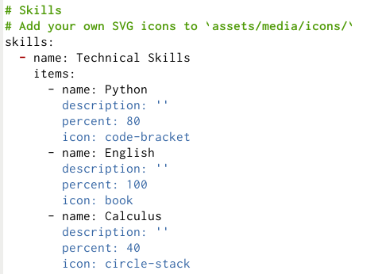
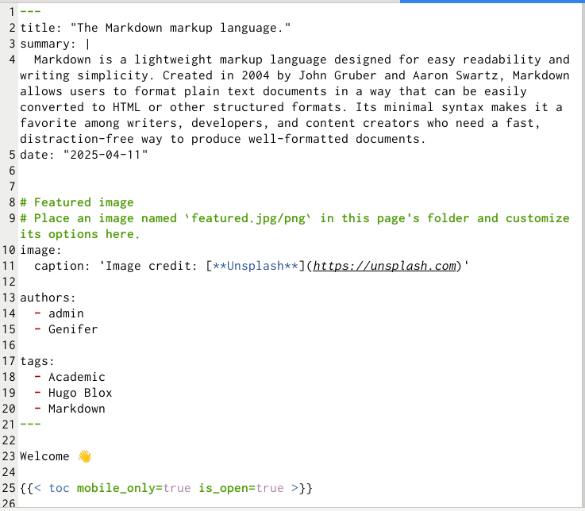
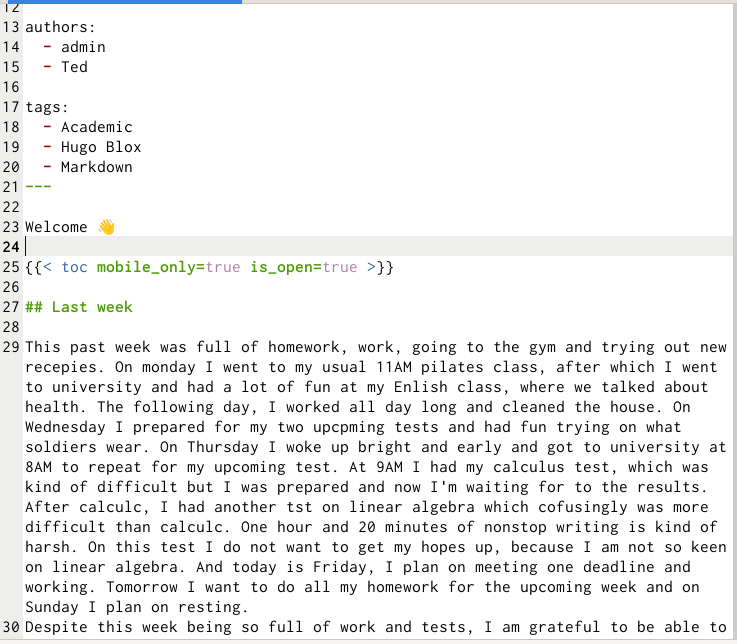

---
## Front matter
lang: ru-RU
title: Третьй этоп индивидуального проекта
subtitle: Индивидуальный проект
author:
  - Виеру Женифер
institute:
  - Российский университет дружбы народов, Москва, Россия
date: 22 марта 2025

## i18n babel
babel-lang: russian
babel-otherlangs: english

## Formatting pdf
toc: false
toc-title: Содержание
slide_level: 2
aspectratio: 169
section-titles: true
theme: metropolis
header-includes:
 - \metroset{progressbar=frametitle,sectionpage=progressbar,numbering=fraction}
---

# Информация

## Докладчик

:::::::::::::: {.columns align=center}
::: {.column width="70%"}

  * Виеру Женифер
  * студентка первого курса 
  * направление "Математика и механика" первая группа
  * Российский университет дружбы народов
  * [1132246785@pfur.ru](mailto:1132246785@pfur.ru)
  * <https://github.com/vgenifer/study_2024-2025_os-intro.git>

:::
::: {.column width="30%"}

:::
::::::::::::::

# Вводная часть

## Объект и предмет исследования

- Индивидуальный проект Персональный сайт научного работника

## Цели и задачи

- Добавить информацию о навыках (Skills).
- Добавить информацию об опыте (Experience).
- Добавить информацию о достижениях (Accomplishments).
- Сделать пост по прошедшей неделе.
- Добавить пост на тему Язык разметки Markdown.

## Теоретическое введение 
Сайт это совокупность веб-страниц, объединенных под общим доменом и связанных ссылками, тематиуой и дизайнерским оформлением. Мы будем создавать статический сайт, для этого нам понадобиться Hugo. Hugo - генератор статических страниц для интернета. 
Мы продолжаем работу с Hugo. Будем учиться редактировать данные о себе и писать посты. 

# Выполнение проекта 

## 1 этап 

:::::::::::::: {.columns align=center}
::: {column width="45%"}

- Добавление информацию о навыках (Skills).
- Добавление информацию об опыте (Experience).
- Добавление информацию о достижениях (Accomplishments).

:::
::: {/column width ="55%"}

:::
::::::::::::::

## 2 этап

:::::::::::::: {.columns align=center}
::: {column width="45%"}

- Создание поста по прошедшей неделе

:::
::: {/column width ="55%"}

:::
::::::::::::::

## 3 этап

:::::::::::::: {.columns align=center}
::: {column width="45%"}

- Создание поста по "Язык разметки Markdown"
:::
::: {/column width ="55%"}

:::
::::::::::::::

# Заключение 

## Краткие выводы 

В ходе выполнение третьего этапа индивидуального проекта:
- Добавила информацию о навыках (Skills).
- Добавила информацию об опыте (Experience).
- Добавила информацию о достижениях (Accomplishments).
- Сделала пост по прошедшей неделе 
- Сделала поста по "Язык разметки Markdown"
