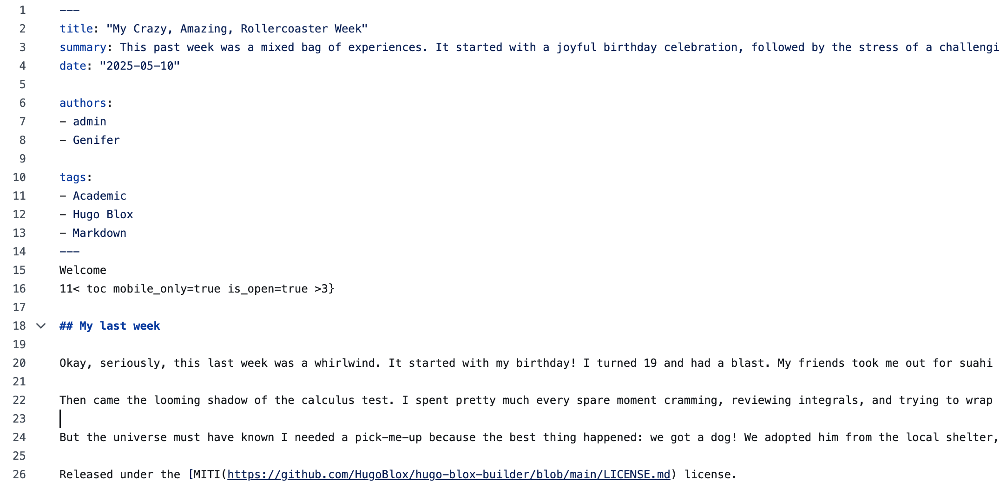
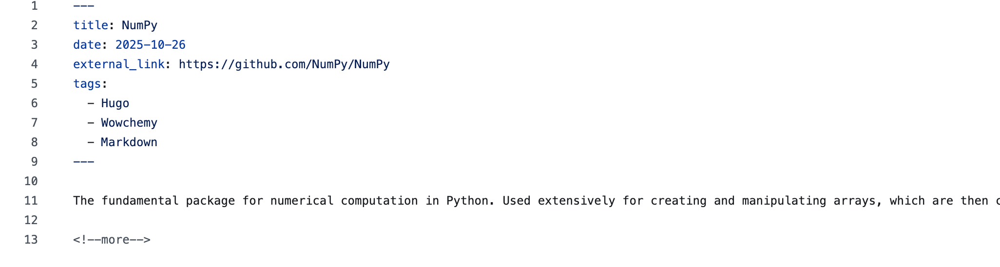
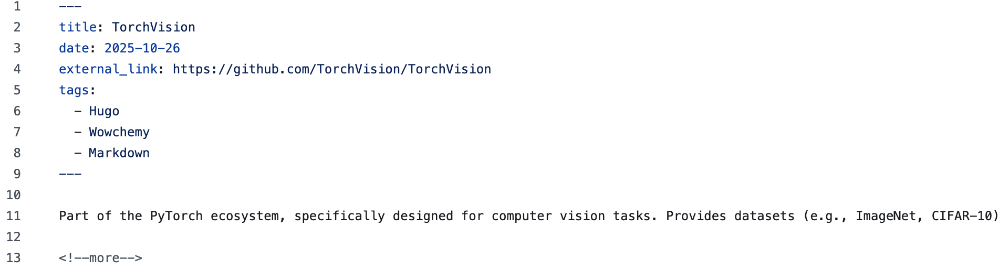
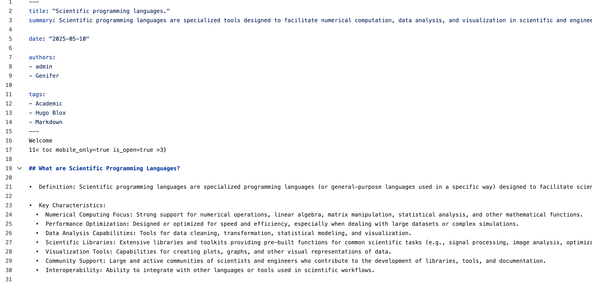

---
## Front matter
lang: ru-RU
title: 5-ый этап индивидуального проекта
author:
  - Виеру Ж.
institute:
  - Российский университет дружбы народов, Москва, Россия
date: 01 января 1970

## i18n babel
babel-lang: russian
babel-otherlangs: english

## Formatting pdf
toc: false
toc-title: Содержание
slide_level: 2
aspectratio: 169
section-titles: true
theme: metropolis
header-includes:
 - \metroset{progressbar=frametitle,sectionpage=progressbar,numbering=fraction}
---

# Информация

## Докладчик

:::::::::::::: {.columns align=center}
::: {.column width="70%"}

  * Виеру Женифер
  * студентка первого курса "Матеиатика и механика"
  * Российский университет дружбы народов
  * [kulyabov-ds@rudn.ru](mailto:kulyabov-ds@rudn.ru)
  * <https://yamadharma.github.io/ru/>

:::
::: {.column width="30%"}

:::
::::::::::::::

# Вводная часть

## Цели и задачи

На этам этапе я сделаю записи для персональных проектов, сделаю пост по прошедшей неделе и по "Языки научного программирования".

## Пост по предыдущей неделе

- "My Crazy, Amazing, Rollercoaster Week"

:::
::: {.column width="30%"}

:::
:::::::::::::: 

## Записи 1 для персональных проектов

- NumPy

:::
::: {.column width="30%"}

:::
::::::::::::::  

## Записи 2 для персональных проектов

- TorchVision

:::
::: {.column width="30%"}

:::
:::::::::::::: 

## Пост по "Языки научного программирования"

- Языки научного программирования

:::
::: {.column width="30%"}

:::
:::::::::::::: 
 

