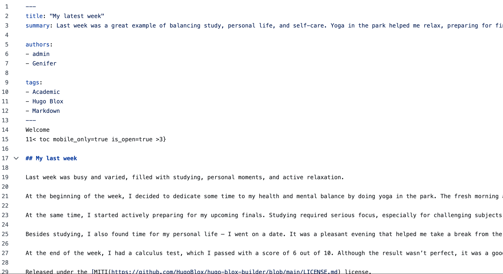
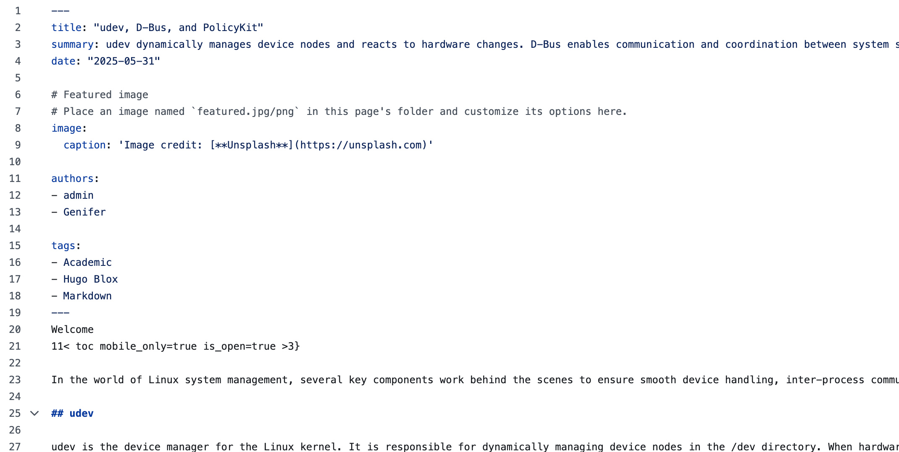
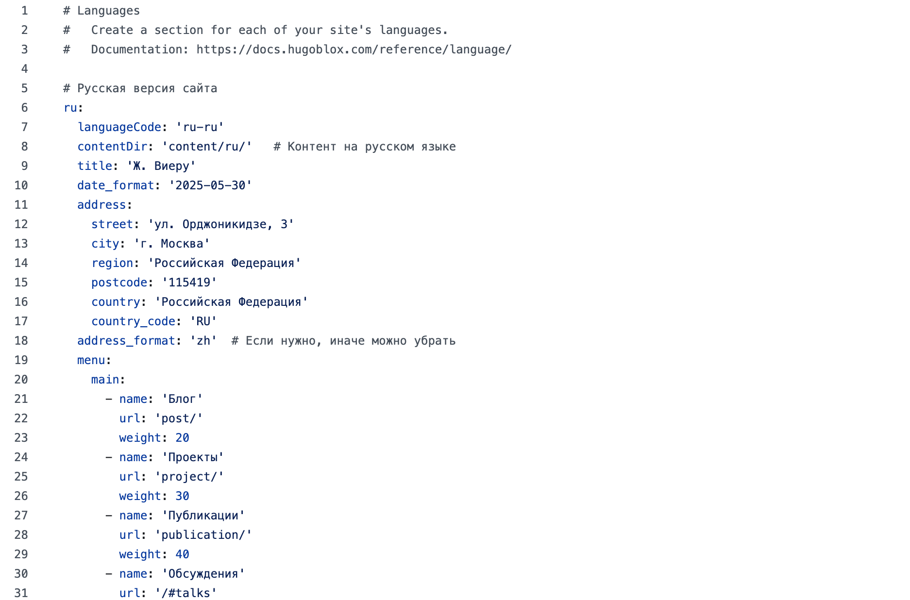

---
## Front matter
lang: ru-RU
title: 6-ый этап индивидуального проекта
author:
  - Виеру Ж.
institute:
  - Российский университет дружбы народов, Москва, Россия

## i18n babel
babel-lang: russian
babel-otherlangs: english

## Formatting pdf
toc: false
toc-title: Содержание
slide_level: 2
aspectratio: 169
section-titles: true
theme: metropolis
header-includes:
 - \metroset{progressbar=frametitle,sectionpage=progressbar,numbering=fraction}
---

# Информация

## Докладчик

:::::::::::::: {.columns align=center}
::: {.column width="70%"}

  * Виеру Женифер
  * студентка первого курса "Математика и механика"
  * Российский университет дружбы народов
  * [1123346785@pfur.ru](mailto:1123346785@pfur.ru)
  * <https://vgenifer.github.io/ru/>

:::
::: {.column width="30%"}

:::
::::::::::::::

# Вводная часть

## Цели и задачи

На этам этапе я сделаю поддержку английского и русского языков, размешу элементы сайта на обоих языках и контент на обоих языках. Потом сделаю пост по прошедшей неделе и добавлю пост на тему udev, DBus, PolicyKit

## Пост по предыдущей неделе

- "My latest week"

:::
::: {.column width="30%"}

:::
:::::::::::::: 

## Пост по udev, DBus, PolicyKit

- udev, DBus, PolicyKit

:::
::: {.column width="30%"}

:::
::::::::::::::  

## Добавление языка

- Laguages.ymal

:::
::: {.column width="30%"}

:::
:::::::::::::: 

 
