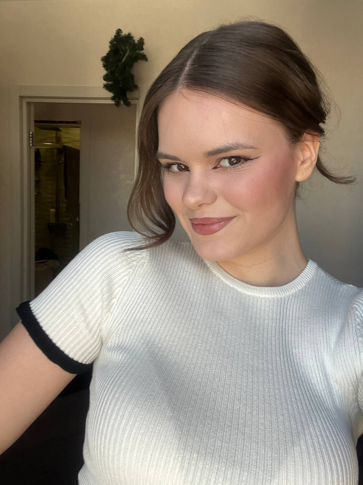

---
## Front matter
lang: ru-RU
title: 6-ый этап индивидуального проекта
author:
  - Виеру Ж.
institute:
  - Российский университет дружбы народов, Москва, Россия

## i18n babel
babel-lang: russian
babel-otherlangs: english

## Formatting pdf
toc: false
toc-title: Содержание
slide_level: 2
aspectratio: 169
section-titles: true
theme: metropolis
header-includes:
 - \metroset{progressbar=frametitle,sectionpage=progressbar,numbering=fraction}
---

# Информация

## Докладчик

:::::::::::::: {.columns align=center}
::: {.column width="70%"}

  * Виеру Женифер
  * студентка первого курса "Математика и механика"
  * Российский университет дружбы народов
  * [1123346785@pfur.ru](mailto:1123346785@pfur.ru)
  * <https://vgenifer.github.io/ru/>

:::
::: {.column width="30%"}

:::
::::::::::::::

# Вводная часть

## Цели и задачи

На этам этапе я Сделать поддержку английского и русского языков.
Разместить элементы сайта на обоих языках.
Разместить контент на обоих языках.
Сделать пост по прошедшей неделе.
Добавить пост на тему по выбору (на двух языках).

## Пост по предыдущей неделе

- "My Crazy, Amazing, Rollercoaster Week"

:::
::: {.column width="30%"}

:::
:::::::::::::: 

## Записи 1 для персональных проектов

- NumPy

:::
::: {.column width="30%"}

:::
::::::::::::::  

## Записи 2 для персональных проектов

- TorchVision

:::
::: {.column width="30%"}

:::
:::::::::::::: 

## Пост по "Языки научного программирования"

- Языки научного программирования

:::
::: {.column width="30%"}

:::
:::::::::::::: 
 
