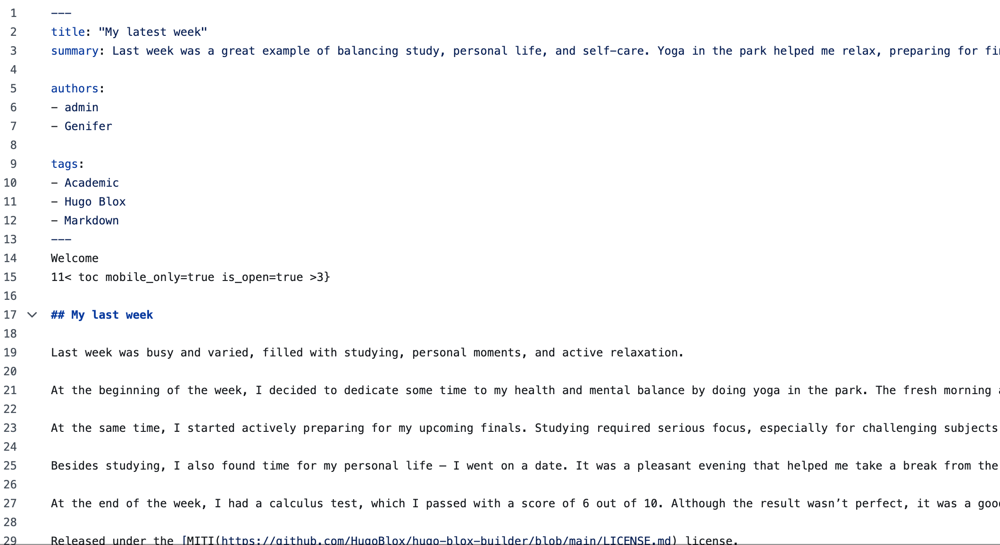
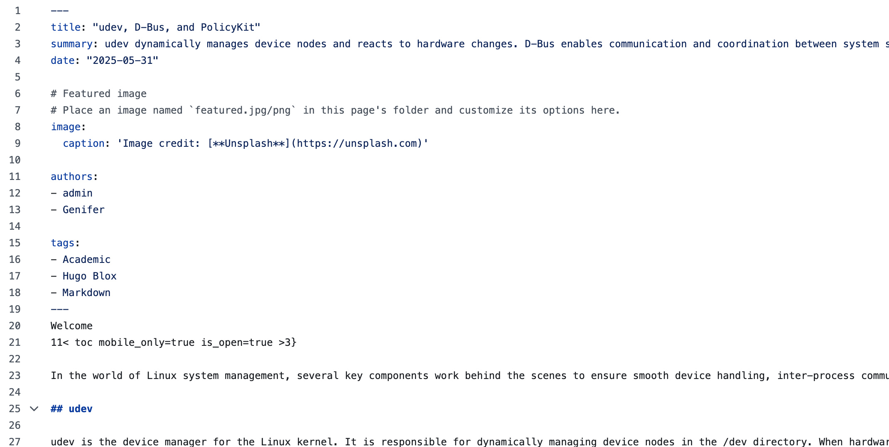
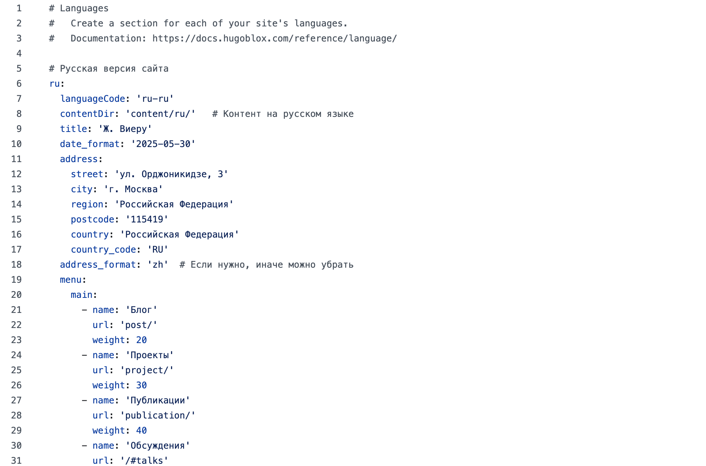

---
## Front matter
title: "Отчет по выпонению 6-ого этапа индивидуального проекта "
subtitle: "Сайт научного работника"
author: "Виеру Женифер"

## Generic otions
lang: ru-RU
toc-title: "Содержание"

## Bibliography
bibliography: bib/cite.bib
csl: pandoc/csl/gost-r-7-0-5-2008-numeric.csl

## Pdf output format
toc: true # Table of contents
toc-depth: 2
lof: true # List of figures
lot: true # List of tables
fontsize: 12pt
linestretch: 1.5
papersize: a4
documentclass: scrreprt
## I18n polyglossia
polyglossia-lang:
  name: russian
  options:
	- spelling=modern
	- babelshorthands=true
polyglossia-otherlangs:
  name: english
## I18n babel
babel-lang: russian
babel-otherlangs: english
## Fonts
mainfont: IBM Plex Serif
romanfont: IBM Plex Serif
sansfont: IBM Plex Sans
monofont: IBM Plex Mono
mathfont: STIX Two Math
mainfontoptions: Ligatures=Common,Ligatures=TeX,Scale=0.94
romanfontoptions: Ligatures=Common,Ligatures=TeX,Scale=0.94
sansfontoptions: Ligatures=Common,Ligatures=TeX,Scale=MatchLowercase,Scale=0.94
monofontoptions: Scale=MatchLowercase,Scale=0.94,FakeStretch=0.9
mathfontoptions:
## Biblatex
biblatex: true
biblio-style: "gost-numeric"
biblatexoptions:
  - parentracker=true
  - backend=biber
  - hyperref=auto
  - language=auto
  - autolang=other*
  - citestyle=gost-numeric
## Pandoc-crossref LaTeX customization
figureTitle: "Рис."
tableTitle: "Таблица"
listingTitle: "Листинг"
lofTitle: "Список иллюстраций"
lotTitle: "Список таблиц"
lolTitle: "Листинги"
## Misc options
indent: true
header-includes:
  - \usepackage{indentfirst}
  - \usepackage{float} # keep figures where there are in the text
  - \floatplacement{figure}{H} # keep figures where there are in the text
---

# Цель работы

На этам этапе я сделаю поддержку английского и русского языков, размешу элементы сайта на обоих языках и контент на обоих языках. Потом сделаю пост по прошедшей неделе и добавлю пост на тему udev, DBus, PolicyKit

# Выполнение лабораторной работы

Я написала пост по предыдущей неделе (рис. [-@fig:001]).

{#fig:001 width=70%}

Потом я сделала посто про udev, DBus, PolicyKit (рис. [-@fig:002]).

{#fig:002 width=70%}

После этого я меняла язык на русский и разместила все элементы сайта и конент на обоих языках  (рис. [-@fig:004]).

){#fig:004 width=70%}

# Выводы

Я сделала поддержку английского и русского языков, разместила элементы сайта на обоих языках и контент на обоих языках. Потом сделала пост по прошедшей неделе и добавила пост на тему udev, DBus, PolicyKit

# Список литературы{.unnumbered}

::: {#refs}
:::
